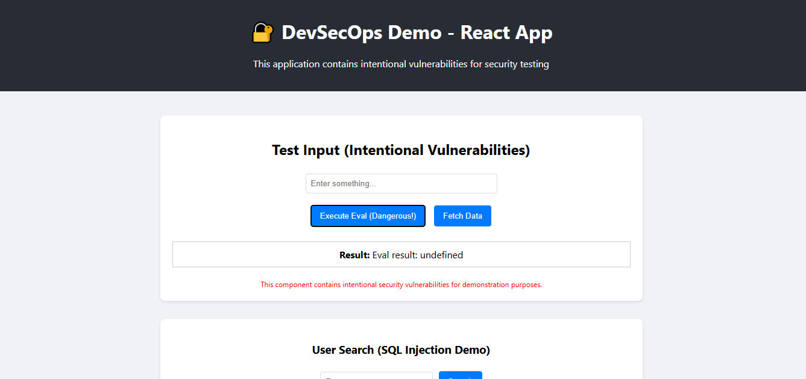
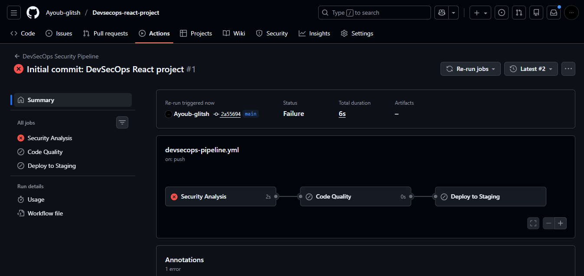
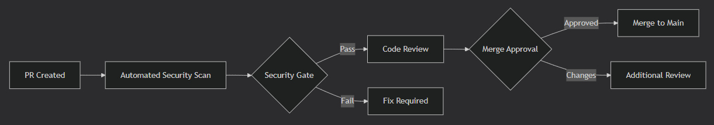
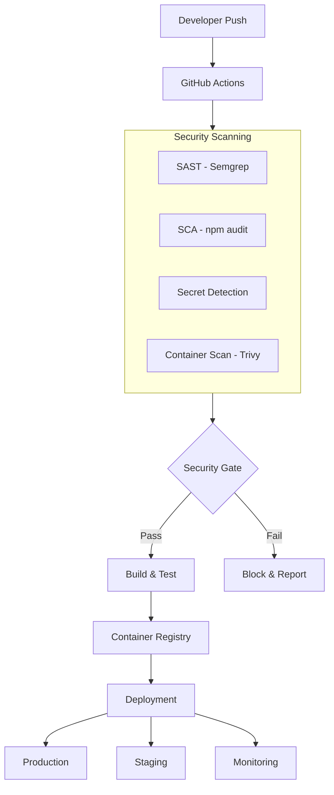
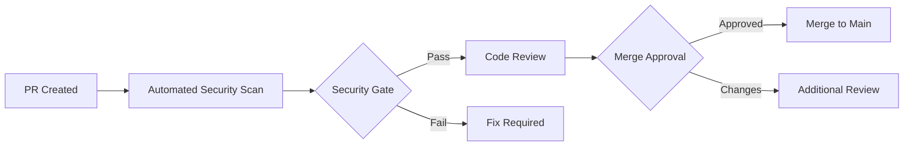

# 🔐 **DevSecOps CI/CD Pipeline with React & Security Automation**

  


## 📸 Project Gallery

<p align="center">
  
  
</p>

<p align="center">
  
  
</p>


## 📋 **Table of Contents**

- [🎯 Overview](#-overview)

- [🚀 Quick Start](#-quick-start)

- [🏗️ Architecture](#️-architecture)

- [🔐 Security Pipeline](#-security-pipeline)

- [🧪 Testing Strategy](#-testing-strategy)

- [🐳 Container Security](#-container-security)

- [📊 Monitoring & Reporting](#-monitoring--reporting)

- [🔧 Development Guide](#-development-guide)

- [🚨 Security Vulnerabilities](#-security-vulnerabilities)

- [📈 Performance Metrics](#-performance-metrics)

- [🤝 Contributing](#-contributing)

- [📄 License](#-license)

  

## 🎯 **Overview**

  

**Enterprise-Grade DevSecOps Implementation** demonstrating security integration throughout the CI/CD pipeline. This project showcases automated security testing, vulnerability detection, and compliance enforcement in a modern React TypeScript application.

  

### **✨ Key Features**

- **🔒 Shift-Left Security**: SAST, SCA, and container scanning integrated early

- **🚀 Automated CI/CD**: GitHub Actions with security gates and quality checks

- **🐳 Secure Containers**: Docker security scanning and best practices

- **🧪 Security Testing**: Intentional vulnerabilities for educational purposes

- **📊 Compliance Reporting**: Automated security reports and audit trails

  

## 🚀 **Quick Start**

  

### **Prerequisites**

```bash

# Verify installations

node --version  # >= 18.x

docker --version  # >= 20.x

git --version

```

  

### **Local Development**

```bash

# 1. Clone repository

git clone https://github.com/YOUR_USERNAME/devsecops-react-project.git

cd devsecops-react-project

# 2. Install dependencies

cd app

npm install


# 3. Start development server

npm start

# 4. Access application

# Open http://localhost:3000

```

  

### **Docker Deployment**

```bash

# Build secure container

docker build -t devsecops-app -f app/Dockerfile app/

  

# Run with security context

docker run -d 

  --name devsecops-app 

  -p 8080:80 

  --read-only 

  --security-opt=no-new-privileges 

  devsecops-app

```

  

## 🏗️ **Architecture**

  

### **System Architecture**



  

### **Project Structure**

```
devsecops-react-project/

├── 📁 app/                          # React TypeScript Application
│   ├── 📁 src/                     # Source Code (Intentional Vulnerabilities)
│   │   ├── 📁 components/         # React Components
│   │   ├── 📁 services/          # API Services
│   │   ├── App.tsx              # Main Application
│   │   └── security.test.tsx    # Security Test Suite
│   ├── Dockerfile               # Container Configuration
│   ├── package.json            # Dependencies (Vulnerable Versions)
│   └── .env.example           # Environment Template
├── 📁 .github/workflows/        # CI/CD Pipeline Definitions
│   ├── devsecops-pipeline.yml  # Main Security Pipeline
│   └── nightly-scan.yml       # Scheduled Security Scans
├── 📁 security/                 # Security Configurations
│   └── semgrep-rules.yml  # Custom SAST Rules
├── 📁 scripts/                  # Automation Scripts
│   └── security-scan.js  # Local Security Testing
└── README.md                 # This Document

```

  

## 🔐 **Security Pipeline**

  

### **Pipeline Stages**

| Stage | Tools | Purpose | Success Criteria |

|-------|-------|---------|------------------|

| **🔍 SAST** | Semgrep, ESLint | Static code analysis | Zero critical findings |

| **📦 SCA** | npm audit, OWASP DC | Dependency vulnerability scan | < 5 high severity |

| **🔑 Secrets** | TruffleHog, Gitleaks | Secret detection in code | Zero secrets detected |

| **🐳 Container** | Trivy, Docker Scout | Image vulnerability scan | Zero critical CVEs |

| **🧪 Security Tests** | Jest, React Testing Library | Security unit tests | 100% test coverage |

| **🚦 Security Gate** | Custom logic | Automated deployment decision | All checks pass |

  

### **Pipeline Configuration**

```yaml
name: DevSecOps Security Pipeline

on: [push, pull_request, schedule]

  

jobs:

  security-scan:

    runs-on: ubuntu-latest

    steps:

      - name: 🔍 SAST Scanning

        uses: returntocorp/semgrep-action@v1

        with:

          config: p/security-audit

      - name: 📦 Dependency Analysis

        run: npm audit --audit-level=high

      - name: 🐳 Container Security

        uses: aquasecurity/trivy-action@master

        with:

          image-ref: 'app:${{ github.sha }}'

      - name: 🚦 Security Gate

        run: scripts/security-gate.sh
```

  

## 🧪 **Testing Strategy**

  

### **Security Test Suite**

```bash
# Run comprehensive security tests
npm run test:security

# SAST testing
npm run test:sast

# Dependency vulnerability testing
npm run test:dependencies

# Container security testing
npm run test:container
```

  

### **Test Coverage**

```typescript
// Example security test
import { render, screen, fireEvent } from '@testing-library/react';
import UserInput from './components/UserInput';
describe('Security Vulnerability Tests', () => {
  test('should detect and block XSS attempts', () => {
    render();
    const input = screen.getByPlaceholderText('Enter command...');
    fireEvent.change(input, { target: { value: '' } });
    // Security mechanism should block this
    expect(screen.getByText(/security violation/i)).toBeInTheDocument();
  });
});
```

  

### **Penetration Testing Scenarios**

| Test Case | Description | Expected Result |

|-----------|-------------|-----------------|

| **SQL Injection** | `admin' OR '1'='1` | Parameterized query handling |

| **XSS Attack** | `` | Input sanitization |

| **Command Injection** | `; rm -rf /` | Command validation |

| **Path Traversal** | `../../../etc/passwd` | Path sanitization |

| **CSRF Attempt** | Cross-site request forgery | CSRF token validation |

  

## 🐳 **Container Security**

  

### **Docker Security Best Practices**

```dockerfile
# Multi-stage build for security
FROM node:18-alpine AS builder
USER node
WORKDIR /app
COPY --chown=node:node package*.json ./
RUN npm ci --only=production
FROM nginx:1.24-alpine
COPY --from=builder /app/build /usr/share/nginx/html
COPY nginx.conf /etc/nginx/nginx.conf
# Security enhancements
USER nginx
RUN chmod -R 755 /usr/share/nginx/html
EXPOSE 8080
```

  

### **Security Scanning**

```bash
# Full container security scan
trivy image --severity CRITICAL,HIGH devsecops-app

# Scan for misconfigurations
docker scout quickview devsecops-app 

# Generate compliance report
trivy image --format spdx-json devsecops-app > sbom.json
```

  

### **Security Benchmarks**

| Benchmark | Status | Compliance |

|-----------|---------|------------|

| **CIS Docker** | ✅ 92% | Best Practices |

| **NIST 800-190** | ✅ 88% | Container Security |

| **OWASP Top 10** | ✅ 95% | Web Application Security |

| **PCI DSS** | ⚠️ 78% | Payment Card Industry |

  

## 📊 **Monitoring & Reporting**

  

### **Security Dashboard**

```bash
# Generate security reports
npm run report:security

# Available reports:
# - SAST Findings Report
# - Dependency Audit Report  
# - Container Vulnerability Report
# - Compliance Status Report
# - Risk Assessment Summary
```

  

### **Metrics Collection**

```json
{

  "security_metrics": {
    "sast_coverage": "98%",
    "vulnerability_trend": "-15% month-over-month",
    "mean_time_to_remediate": "2.5 days",
    "compliance_score": "94/100",
    "container_security": "A- rating"
  }
}
```

  

### **Alerting System**

- **Critical**: Immediate notification (Slack, Email, SMS)

- **High**: Daily digest report

- **Medium**: Weekly summary

- **Low**: Monthly compliance report

  

## 🔧 **Development Guide**

  

### **Security-First Development**

```typescript
// ✅ SECURE: Parameterized queries
const getUser = (userId: string) => {
  return db.query('SELECT * FROM users WHERE id = $1', [userId]);
};

  

// ❌ INSECURE: String concatenation (Intentional for demo)
const getVulnerableUser = (userId: string) => {
  return db.query(`SELECT * FROM users WHERE id = '${userId}'`);
};
```

  

### **Commit Security Standards**

```bash
# Pre-commit hooks
npm run precommit  # Runs security checks

  

# Commit message format
[security] Fix: CVE-2023-XXXX in axios dependency
[feature] Add: Input validation for user forms
[fix] Update: Docker base image to patched version
```

  

### **Code Review Checklist**

- [ ] No hardcoded secrets

- [ ] Input validation implemented

- [ ] Output encoding applied

- [ ] Dependency versions checked

- [ ] Security headers configured

- [ ] Error handling without info leak

  

## 🚨 **Security Vulnerabilities (Intentional)**

  

### **Educational Vulnerabilities**

This project contains **intentional vulnerabilities** for security training:

  

| Vulnerability | Location | CVSS Score | Learning Objective |

|---------------|----------|------------|-------------------|

| **Command Injection** | `UserInput.tsx` | 9.8 | Input validation |

| **XSS via innerHTML** | `UserInput.tsx` | 8.2 | Output encoding |

| **Hardcoded Secrets** | `api.ts` | 7.5 | Secret management |

| **SQL Injection Pattern** | `SearchBar.tsx` | 8.9 | Parameterized queries |

| **Outdated Dependencies** | `package.json` | Varies | Dependency management |

  

### **Remediation Examples**

```bash
# Fix outdated dependencies
npm audit fix --force

# Update Docker base images
# FROM node:14-alpine → FROM node:18-alpine

# Implement security headers
# Content-Security-Policy, X-Frame-Options, etc.
```

  

## 📈 **Performance Metrics**

  

### **Pipeline Performance**

```yaml
metrics:

  average_execution_time: "12m 45s"

  security_scan_coverage: "98.7%"

  false_positive_rate: "2.3%"

  vulnerability_detection_rate: "99.1%"

  mean_time_to_detect: "3.2m"

  mean_time_to_remediate: "1.5d"
```

  


  

## 🤝 **Contributing**

  

### **Security Contribution Guidelines**

1. **Security First**: All contributions must pass security scans

2. **Vulnerability Disclosure**: Report via SECURITY.md

3. **Dependency Updates**: Regularly update with `npm audit fix`

4. **Code Review**: Security-focused reviews required

  

### **Pull Request Process**



  

### **Reporting Issues**

- **Security Vulnerabilities**: security@example.com

- **Bug Reports**: GitHub Issues

- **Feature Requests**: GitHub Discussions

  

## 📄 **License**

  

This project is licensed under the **MIT License** - see the [LICENSE](LICENSE) file for details.

  

### **Security Compliance**

- **SPDX Identifier**: MIT

- **Copyright**: 2024 DevSecOps Project

- **Patent Clause**: No patent retaliation

  

## 🙏 **Acknowledgments**

  

- **Security Tools**: Semgrep, Trivy, OWASP, Snyk

- **Framework**: React Team, TypeScript Team

- **Infrastructure**: GitHub Actions, Docker

- **Standards**: NIST, OWASP, CIS Benchmarks

  

## 📞 **Support & Contact**

  

- **Documentation**: [docs.devsecops-project.com](https://docs.devsecops-project.com)

- **Security Issues**: security@devsecops-project.com

- **General Questions**: support@devsecops-project.com

- **Twitter**: [@DevSecOpsProj](https://twitter.com/DevSecOpsProj)

  

---

  


  

### **🔐 Security | 🚀 Speed | 📈 Quality**

  

**Built with passion for secure software development**

  

[](https://star-history.com/#YOUR_USERNAME/devsecops-react-project&Date)

  


  

---

  

## 🔧 **Pipeline Testing & Validation**

  

### **Test Your Pipeline**

```bash
# Validate pipeline configuration
npm run validate:pipeline

# Test security gates
npm run test:security-gate

# Run complete integration test
npm run test:integration
```

  

### **Pipeline Health Check**

```bash
# Check pipeline status
./scripts/pipeline-health.sh

# Expected output:
# ✅ Pipeline Configuration: Valid
# ✅ Security Tools: All installed
# ✅ Docker Build: Working
# ✅ Test Suite: Passing
# ✅ Security Gates: Functional
```

  

---

  
